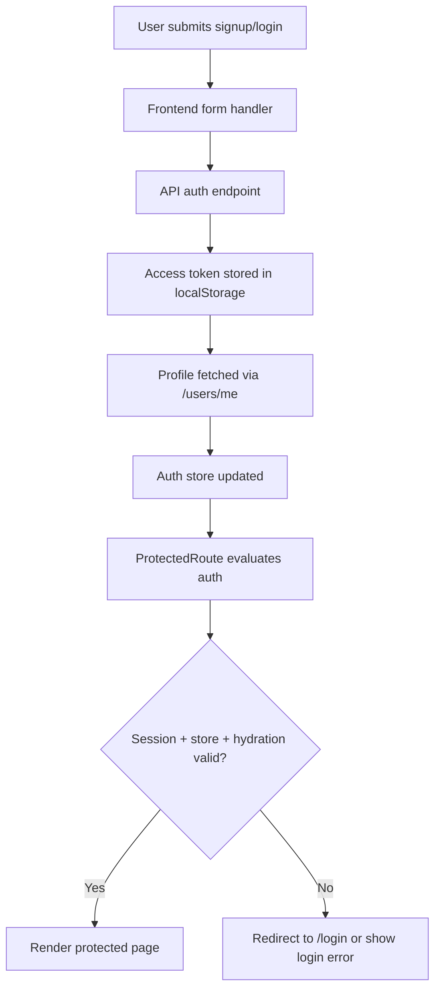

# FOUNDATION.AUDIT.1 — Application Architecture, Auth Flow & Lovable Reference Audit

## Executive Summary

این آدیت نشان می‌دهد که پایه‌ی فعلی برنامه از نظر معماری و جریان احراز هویت، در وضعیت پرریسک قرار دارد. مسیر ریشه‌ی برنامه، تجربه‌ی ورود/ثبت‌نام و حفاظت از مسیرهای خصوصی، هم‌زمان به چند منبع وضعیت وابسته‌اند و این موضوع باعث می‌شود مسیر `/profile` بعد از ثبت‌نام یا ورود، در شرایطی به‌جای نمایش صفحه‌ی پروفایل، به خطای «شما باید ابتدا وارد شوید» برخورد کند.

نکات اصلی:

- مسیر `/` در حال حاضر به‌جای تجربه‌ی Onboarding، به صفحه‌ی Discovery می‌رسد و تجربه‌ی شروع کار به‌صورت مستقیم به onboarding متصل نشده است.
- جریان auth در دو لایه‌ی جداگانه اجرا می‌شود: Zustand برای state محلی و React Query برای session fetch؛ این دو لایه در زمان‌های حساس با هم سنکرون نیستند.
- مسیرهای محافظت‌شده با یک Guard سمت کلاینت کنترل می‌شوند و هیچ middleware یا redirect server-side جدی برای این مسیرها وجود ندارد.
- الگوی Lovable Reference از نظر ساختار UI و feature-based composition ارزشمند است، اما در حوزه‌ی auth و routing باید با معماری فعلی Next.js/App Router سازگار شود.

## Current Architecture Overview

### 1) Root Application Entry Audit

#### مسیر ریشه
- مسیر `/` توسط صفحه‌ی [apps/web/src/app/page.tsx](apps/web/src/app/page.tsx) کنترل می‌شود.
- این صفحه از [apps/web/src/lib/auth.ts](apps/web/src/lib/auth.ts) برای بررسی session و از [apps/web/src/stores/authStore.ts](apps/web/src/stores/authStore.ts) برای خواندن وضعیت auth استفاده می‌کند.

#### Current behavior
- اگر کاربر احراز هویت نشده باشد، صفحه‌ی Discovery نشان داده می‌شود.
- اگر کاربر احراز هویت شده باشد، صفحه‌ی روت به‌صورت خودکار به `/library` هدایت می‌شود.

#### Expected behavior
- برای کاربر ناشناس، باید تجربه‌ی welcome/onboarding یا صفحه‌ی شروع اولیه نمایش داده شود.
- برای کاربر احراز هویت‌شده، باید به تجربه‌ی authenticated-home منتقل شود.

#### Mismatch
- experience‌ی onboarding در پروژه وجود دارد، اما در مسیر ریشه استفاده نمی‌شود.
- مسیر `/` به‌جای onboarding، به Discovery متصل شده است.

#### Possible causes
- منطق روتینگ در [apps/web/src/app/page.tsx](apps/web/src/app/page.tsx) فقط بر اساس auth state و session تصمیم می‌گیرد، اما onboarding feature در [apps/web/src/features/onboarding/components/WelcomeScreen.tsx](apps/web/src/features/onboarding/components/WelcomeScreen.tsx) به این مسیر وصل نشده است.
- `getHomePageMode` در [apps/web/src/app/home-page-mode.ts](apps/web/src/app/home-page-mode.ts) فقط سه حالت `loading | authenticated-home | welcome` را پشتیبانی می‌کند، اما در واقع حالت welcome به‌صورت مستقیم به Discovery تبدیل نمی‌شود.

### 2) Frontend Structure

- App Router Next.js با layout در [apps/web/src/app/layout.tsx](apps/web/src/app/layout.tsx)
- shell مشترک و mobile-first در [apps/web/src/components/layout/app-shell.tsx](apps/web/src/components/layout/app-shell.tsx)
- feature ownership برای auth در [apps/web/src/features/auth](apps/web/src/features/auth)
- feature ownership برای profile در [apps/web/src/features/profile](apps/web/src/features/profile)

### 3) Backend Auth Surface

- ثبت‌نام و ورود در [apps/api/src/auth/auth.controller.ts](apps/api/src/auth/auth.controller.ts)
- JWT guard در [apps/api/src/auth/guards/jwt-auth.guard.ts](apps/api/src/auth/guards/jwt-auth.guard.ts)
- پروفایل کاربر در [apps/api/src/users/users.controller.ts](apps/api/src/users/users.controller.ts)

## Root Cause Findings

### Root Cause 1 — ریشه‌ی برنامه، onboarding را به‌عنوان تجربه‌ی اولیه وصل نکرده است
- مسیر `/` در [apps/web/src/app/page.tsx](apps/web/src/app/page.tsx) صفحه‌ی Discovery را رندر می‌کند.
- در حالی که компонент onboarding در [apps/web/src/features/onboarding/components/WelcomeScreen.tsx](apps/web/src/features/onboarding/components/WelcomeScreen.tsx) وجود دارد، هیچ اتصال Route‌ای یا منطقی به آن در مسیر ریشه انجام نشده است.
- نتیجه: کاربر ناشناس، تجربه‌ی onboarding را نمی‌بیند.

### Root Cause 2 — auth state از دو منبع مستقل تغذیه می‌شود
- Zustand store در [apps/web/src/stores/authStore.ts](apps/web/src/stores/authStore.ts) و React Query session در [apps/web/src/lib/auth.ts](apps/web/src/lib/auth.ts) هر دو وضعیت auth را کنترل می‌کنند.
- فرم‌های ثبت‌نام و ورود در [apps/web/src/features/auth/components/RegisterForm.tsx](apps/web/src/features/auth/components/RegisterForm.tsx) و [apps/web/src/features/auth/components/LoginForm.tsx](apps/web/src/features/auth/components/LoginForm.tsx)، بعد از دریافت profile، فقط Zustand را به‌روزرسانی می‌کنند.
- اما Guard در [apps/web/src/features/auth/components/ProtectedRoute.tsx](apps/web/src/features/auth/components/ProtectedRoute.tsx) هم به `useSession()` و هم به `useAuthStore()` وابسته است.
- نتیجه: در لحظه‌ی ورود/ثبت‌نام، ممکن است Guard هنوز `data` session را در Query cache نداشته باشد و در نتیجه مسیر را به‌عنوان غیرمجاز رد کند.

### Root Cause 3 — Guard پروفایل، شرط‌های احراز هویت را به‌صورت بسیار سخت‌گیرانه بررسی می‌کند
- Guard در [apps/web/src/features/auth/components/ProtectedRoute.tsx](apps/web/src/features/auth/components/ProtectedRoute.tsx) فقط در صورتی اجازه می‌دهد که هم `data` و هم `isAuthenticated` درست باشند.
- این Guard از `useSession()` و Zustand استفاده می‌کند، نه از یک منبع واحد و قطعی.
- نتیجه: در زمان‌های اولیه‌ی هیدراسیون یا بعد از ورود سریع، guard ممکن است به دلیل نبود sync مشترک، ورود را رد کند.

### Root Cause 4 — هیچ middleware یا server-side redirect مرکزی برای auth وجود ندارد
- در پوشه‌ی [apps/web/src](apps/web/src) هیچ فایل middleware یا redirect rule مرکزی برای `/login`, `/register`, `/profile` دیده نمی‌شود.
- مسیرهای محافظت‌شده فقط با component guard در سمت کلاینت کنترل می‌شوند.
- نتیجه: روتینگ و redirect در سطح کلاینت پراکنده و در معرض ناسازگاری است.

## Auth Flow Diagram

## Redirect Map

| Route | Protection | Redirect condition | Redirect destination | Implementation location |
|---|---|---|---|---|
| `/` | Public | Authenticated user | `/library` | [apps/web/src/app/page.tsx](apps/web/src/app/page.tsx) |
| `/login` | Public | N/A | N/A | [apps/web/src/app/login/page.tsx](apps/web/src/app/login/page.tsx) |
| `/register` | Public | N/A | N/A | [apps/web/src/app/register/page.tsx](apps/web/src/app/register/page.tsx) |
| `/profile` | Protected | No valid session or auth state | `/login` | [apps/web/src/app/profile/page.tsx](apps/web/src/app/profile/page.tsx), [apps/web/src/features/auth/components/ProtectedRoute.tsx](apps/web/src/features/auth/components/ProtectedRoute.tsx) |
| `/library` | Protected | Not implemented as a dedicated guard in this audit scope | N/A | [apps/web/src/app/library/page.tsx](apps/web/src/app/library/page.tsx) |
| `/create` | Protected | Wrapper-based protection | N/A | [apps/web/src/app/create/page.tsx](apps/web/src/app/create/page.tsx) |
| `/episodes/new` | Protected | Wrapper-based protection | N/A | [apps/web/src/app/episodes/new/page.tsx](apps/web/src/app/episodes/new/page.tsx) |
| `/podcasts/new` | Protected | Wrapper-based protection | N/A | [apps/web/src/app/podcasts/new/page.tsx](apps/web/src/app/podcasts/new/page.tsx) |

### Redirect Findings

- ریدایرکت signup به profile در [apps/web/src/features/auth/components/RegisterForm.tsx](apps/web/src/features/auth/components/RegisterForm.tsx) انجام می‌شود.
- ریدایرکت login به profile در [apps/web/src/features/auth/components/LoginForm.tsx](apps/web/src/features/auth/components/LoginForm.tsx) انجام می‌شود.
- ریدایرکت بعد از logout در [apps/web/src/features/profile/components/ProfilePage.tsx](apps/web/src/features/profile/components/ProfilePage.tsx) انجام می‌شود.
- هیچ middleware یا server-side protection مرکزی برای این مسیرها وجود ندارد.

## Profile Access Investigation

### سناریوی گزارش‌شده
کاربر بعد از signup موفق، به URL `/profile` می‌رسد اما با پیام «You need to be logged in to access this area.» روبه‌رو می‌شود.

### Exact failure point
- نقطه‌ی شکست در لایه‌ی Guard کلاینت در [apps/web/src/features/auth/components/ProtectedRoute.tsx](apps/web/src/features/auth/components/ProtectedRoute.tsx) اتفاق می‌افتد.
- این Guard هم به `useSession()` و هم به Zustand وابسته است.
- اما فرم ثبت‌نام در [apps/web/src/features/auth/components/RegisterForm.tsx](apps/web/src/features/auth/components/RegisterForm.tsx) فقط Zustand را به‌روزرسانی می‌کند و state‌ی React Query را با query cache همگام نمی‌کند.

### Where authentication state is lost
- state در مسیر بین «submit register» و «ProtectedRoute render» از دست می‌رود.
- منبع authِ Guard و منبع authِ فرم، یکی نیستند.

### Why profile guard rejects the user
- Guard برای نمایش صفحه‌ی پروفایل، نیاز دارد که هم `data` از `useSession()` موجود باشد و هم `isAuthenticated` از Zustand درست باشد.
- در لحظه‌ی ریدایرکت، یکی از این دو ممکن است هنوز به‌روز نشده یا به‌صورت null/undefined باشد.

### Which layer owns the issue
- مالک اصلی مشکل، لایه‌ی frontend auth orchestration است.
- مسئولیت اصلی آن در [apps/web/src/lib/auth.ts](apps/web/src/lib/auth.ts) و [apps/web/src/features/auth/components/ProtectedRoute.tsx](apps/web/src/features/auth/components/ProtectedRoute.tsx) قرار دارد.

## lovable-reference Analysis

### Adopt

- ساختار feature-based برای auth، profile و onboarding؛ این الگو با معماری فعلی Castaminofen سازگار است.
- استفاده از UI primitives و shell مشترک برای تجربه‌ی موبایل‌محور؛ این الگو در [apps/web/src/components/layout/app-shell.tsx](apps/web/src/components/layout/app-shell.tsx) و [apps/web/src/components/ui](apps/web/src/components/ui) دیده می‌شود.
- تم‌محور و طراحی consistent برای تجربه‌ی کاربری؛ این الگو برای MVP قابل پذیرش است.

### Adapt

- onboarding را باید از حالت presentational به یک feature route‌دار و state-aware تبدیل کرد.
- auth flow باید از مدل چندمنبع به یک source of truth واحد تبدیل شود؛ این مدل باید با React Query + Zustand یا با یک لایه‌ی auth مرکزی سازگار باشد.
- redirect logic باید از پراکندگی در فرم‌ها و guardها به یک مکان مرکزی منتقل شود.

### Reject

- استفاده از TanStack Router / TanStack Start به‌عنوان جایگزین Next.js App Router، چون این پروژه بر اساس Next.js و App Router ساخته شده و این تغییر، برای MVP و معماری فعلی over-engineering است.
- اضافه‌کردن middleware یا abstractionهای سنگین برای auth بدون نیاز جاری؛ این کار از اصول MVP و feature ownership دور می‌شود.
- ساختن یک سیستم auth عمومی و آینده‌محور قبل از تثبیت مسیرهای فعلی؛ این کار با الزامات «architecture for change, not architecture for imagination» سازگار نیست.

## MVP Readiness Matrix

| Category | Status | Notes |
|---|---|---|
| Routing | RISK | مسیر ریشه از onboarding جدا است و redirectها پراکنده‌اند. |
| Authentication | BLOCKED | مسیر signup → profile در لایه‌ی Guard دچار ناسازگاری state است. |
| Database | READY | لایه‌ی DB در backend برای auth/profile وجود دارد و از audit فعلی، نشانه‌ی block مستقیم در DB دیده نمی‌شود. |
| API Layer | RISK | auth endpoints و users/me در دسترس‌اند، اما جریان کلاینت با این API‌ها به‌طور کامل همگام نیست. |
| Feature Boundaries | RISK | auth و profile هنوز به‌خوبی از یکدیگر جدا نشده‌اند. |
| UI Foundation | READY | shell، mobile-first UI و primitives وجود دارند. |
| Mobile Foundation | READY | layout و navigation موبایل‌محور در حال حاضر قابل قبول‌اند. |

## Critical Blockers

1. signup/login flow به‌خوبی در یک source of truth واحد ادغام نشده است.
2. profile guard بر اساس چند منبع مختلف تصمیم می‌گیرد و در لحظه‌ی ورود با خطا مواجه می‌شود.
3. onboarding در مسیر ریشه به‌طور واقعی فعال نیست.
4. redirect ownership در سطح کلاینت پراکنده است و هیچ مکان مرکزی برای آن وجود ندارد.

## Recommended Next Phase

پهنه‌ی پیشنهادی بعدی، «Auth Runtime Stabilization & Routing Alignment» است. این phase باید بدون تغییر در معماری کلی و بدون refactor گسترده، بر موارد زیر تمرکز کند:

- یک‌پارچه‌سازی منبع state auth
- هماهنگی بین query session و guard
- اتصال onboarding به مسیر ریشه
- ایجاد یک مکان مرکزی برای redirect و protected-route policy

## Notes

این report صرفاً بر پایه‌ی بازبینی کد و ساختار فعلی تولید شده است و هیچ تغییری در runtime، route، database یا dependencyها اعمال نشده است.